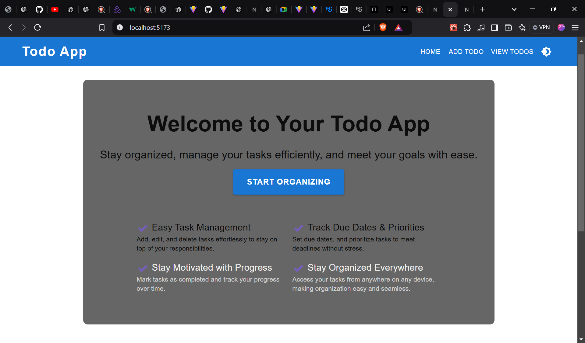

# Todo App Using React and Redux

## Overview
The **Todo App** is a simple and intuitive web application for managing tasks. It allows users to create, view, and organize their to-do lists efficiently. The application is built using React and Material-UI, providing a clean and responsive interface. Additionally, the app includes a dark mode toggle for better usability in different lighting conditions.

## Features
- **Add Todo**: Create new tasks with titles and descriptions.
- **View Todos**: View a list of all tasks with their statuses (completed/pending).
- **Mark as Complete**: Mark tasks as completed to keep track of progress.
- **Delete Todo**: Remove unwanted tasks from the list.
- **Responsive Design**: Adapts seamlessly to different screen sizes.
- **Dark Mode**: Toggle between light and dark themes for a personalized experience.
- **Contact Us**: Integrated contact options via email and WhatsApp.

## Tech Stack
- **Frontend**: React, Material-UI
- **Routing**: React Router
- **Icons**: Material-UI Icons

## Installation
1. Clone the repository:
   ```bash
   git clone https://github.com/your-username/todo-app.git
   ```

2. Navigate to the project directory:
   ```bash
   cd todo-app
   ```

3. Install dependencies:
   ```bash
   npm install
   ```

4. Start the development server:
   ```bash
   npm run dev
   ```

5. Open your browser and visit:
   ```
   http://localhost:3000
   ```

## Folder Structure
```
├── public
├── src
│   ├── components
│   │   ├── Header.jsx      // Top navigation bar
│   │   ├── Footer.jsx      // Footer with contact options
│   │   ├── TodoInput.jsx   // Input field for adding todos
│   │   ├── TodoList.jsx    // Main Todo List component
│   ├── pages
│   │   ├── HomePage.jsx    // Home page
│   ├── App.jsx             // Main application file
│   ├── index.jsx           // Application entry point
│   ├── themes.jsx          // Theme configuration
├── package.json
```

## Available Scripts
- **`npm run dev`**: Starts the development server.
- **`npm run build`**: Builds the app for production.
- **`npm test`**: Runs the test suite.
- **`npm run eject`**: Ejects the app configuration (not recommended).

## Deployment
1. Build the app for production:
   ```bash
   npm run build
   ```

2. Deploy the `build/` folder to your hosting provider.

## Usage
- **Homepage**: Displays the header with navigation and an introduction.
- **Add Todo**: Navigate to `/add-todo` to create a new task.
- **View Todos**: Navigate to `/todos` to see all tasks with options to edit or delete them.
- **Dark Mode**: Use the toggle button in the header to switch themes.

## Contact
For any questions or support, contact us:
- **Email**: [support@example.com](mailto:support@example.com)
- **WhatsApp**: [Chat on WhatsApp](https://wa.me/7499385295)

## License
This project is licensed under the [MIT License](LICENSE).

## Acknowledgments
- **Material-UI**: For providing the design components.
- **React Router**: For enabling routing in the app.
- **Icons**: Courtesy of Material-UI Icons.
- 
## Screenshots

### Light Theme Home page


### Dark Theme Home page


### Light Theme Add Todo Page


### Dark Theme Add Todo page


### Light Theme Todo List page


### Dark Theme List Todo page


### Footer

